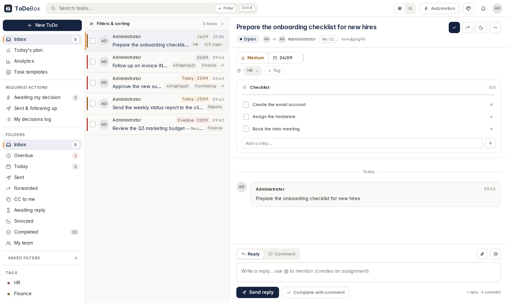
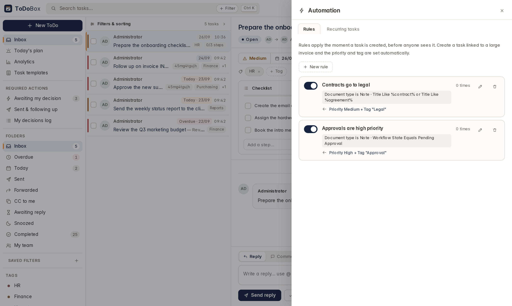
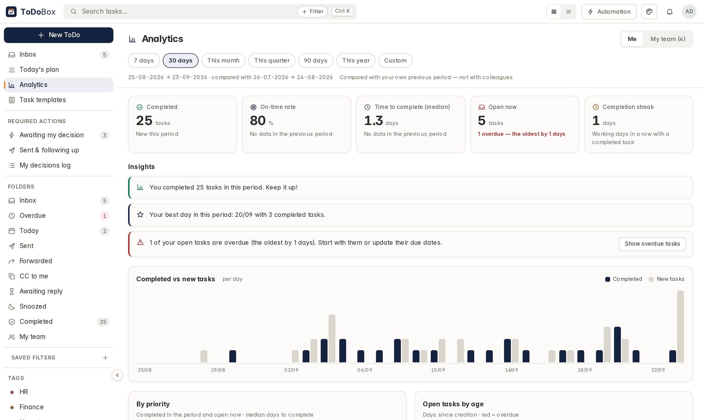

<div align="center" markdown="1">
	
	<h1>ToDoBox</h1>

**Every task and approval waiting for you, in one box — for Frappe**
</div>

<div align="center">
	<a target="_blank" href="license.txt" title="License: AGPL-3.0"></a>
	
</div>

## ToDoBox

ToDoBox turns Frappe's `ToDo` into a full-screen workspace that reads like an inbox, served at
`/todobox`. Tasks stay `ToDo` records, conversations stay comments and approvals stay Frappe Workflow —
the app adds the screen, not another silo.



### Features

- **Required actions** — one place for everything waiting on you: assigned tasks, and documents
  pending your approval in Frappe Workflow, with the transition buttons and a decision log.
- **Checklists** — split a task into steps and track progress; reusable task templates fill them in one click.
- **Recurring tasks** — daily to yearly, created automatically with their checklist and tags.
- **Inbox folders** — Inbox, Today, Overdue, Sent, Forwarded, CC to me, Awaiting reply, Snoozed and
  Completed, with live counts.
- **Threads** — replies, internal comments and attachments on every task.
- **Reference preview** — the linked document opens beside the task, without leaving the page.
- **Automation rules** — match a document type on any of its fields, then set a priority or add tags.
- **Day plan and analytics** — order today's work; track completion and on-time rates for you or the team.
- **Arabic and RTL** — fully translated and mirrored.




## Install

Requires Frappe Framework v16. ERPNext is optional — any DocType can be a task's reference.

```bash
bench get-app <repo-url>
bench --site <site-name> install-app todobox
bench --site <site-name> migrate
```

Open `https://<site-name>/todobox`, or use the ToDoBox icon on the Desk home screen.

Coming from `frappe_taskmail`, `todo_tool` or `todo_management`? Install ToDoBox first: it imports
their templates, rules, recurring tasks, checklists and saved views, and takes ownership of the custom
fields on `ToDo`. Check the data, then uninstall the old app.

## Development

The front end is plain JavaScript and CSS under `todobox/public` — no build step, just reload.

| Path | What lives there |
| --- | --- |
| `todobox/api.py` | whitelisted endpoints the UI calls |
| `todobox/services/` | the logic behind them |
| `todobox/todobox/doctype/` | rules, recurring tasks, templates, saved views |
| `todobox/public/js/hub/` | the screens |
| `todobox/www/todobox.html` | the page shell |

Strings go through `_()` in Python and `__()` in JavaScript; after adding some, run
`bench update-po-files --app todobox` and `bench compile-po-to-mo --app todobox`.

## License

[GNU Affero General Public License v3.0](license.txt) — if you run a modified version on a server for
others, you must offer them its source too.
